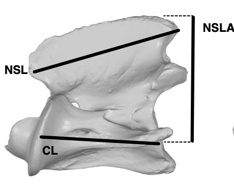
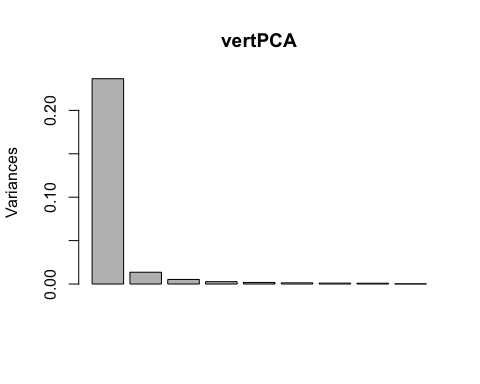
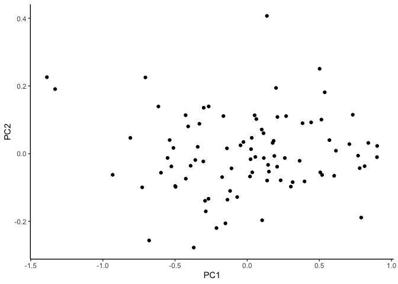
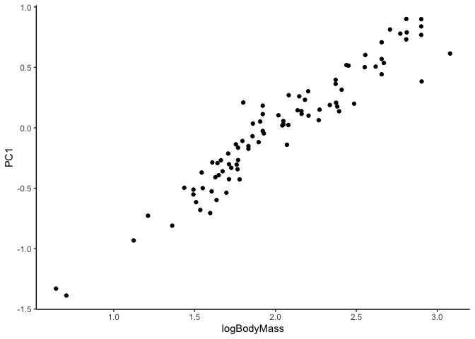
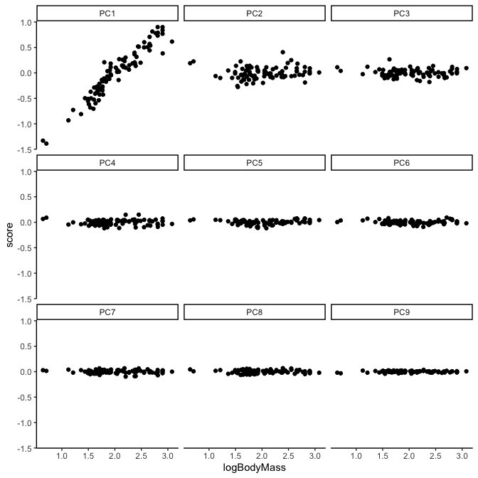
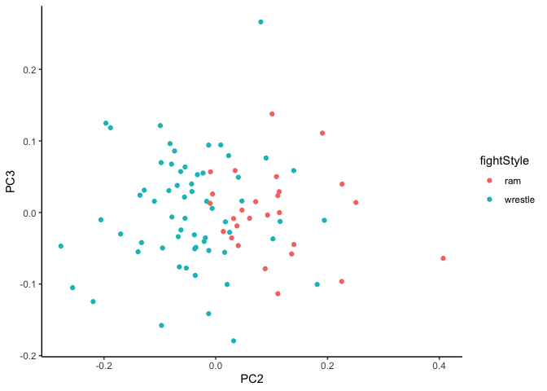
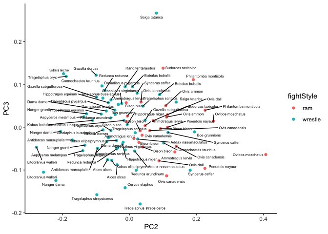
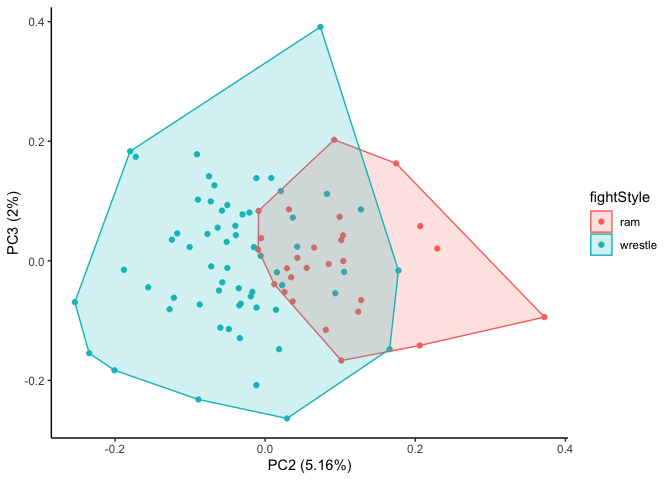
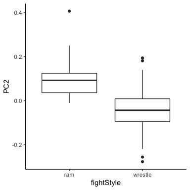
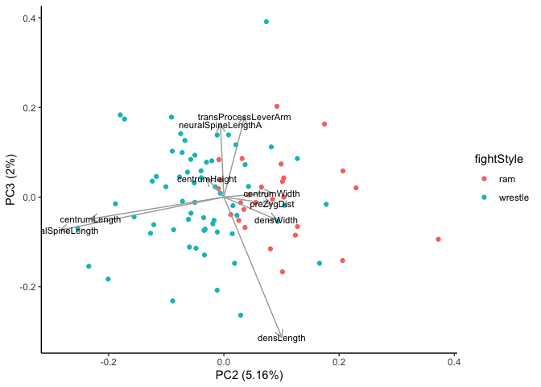

Principal Components Analysis in R
================
Abby Vander Linden
3/2/2020

-----

## Friends Help Friends Use PCA

PCA is an ordination method that allows you to identify the principal
component axes that explain the greatest amount of variation among
interrelated variables in your data. For PCA, you need continuous data
(or something that your field considers continuous, like emotion
intensity on a scale of 1-100 – hi Madi\!). There are other ordination
analyses you can do with non-continuous data, but I’ll focus on PCA
here.

We’ll use a subset of the linear morphometric dataset from my paper on
cervical vertebra shape in ruminant mammals – strangely enough, the only
paper I’ve published so far where I *didn’t* include a PCA. But the data
are a useful PCA practice set because I have many linear measurements of
different vertebral features across 40 species, including males and
females as well as members of different “fighting behavior” categories.

My aim was to determine whether species that ram horns head-on, like
bighorn sheep and bison, have different shaped neck veretbrae than
species that lock horns and wrestle, like antelope and deer.
Spoiler–they do\! The original data and paper can be found here:
[Vander Linden & Dumont 2019, Proceedings of the Royal Society
B](https://royalsocietypublishing.org/doi/full/10.1098/rspb.2019.2199).

## Import and Tidy Data

### Load tidyverse library

The first step is to install and load the tidyverse package if you
haven’t already. Tidyverse contains a lot of useful packages,
including dplyr and ggplot2, which we will use here. [You should be
friends with the tidyverse\!](https://tidyverse.tidyverse.org/)

We’ll also load the ggrepel library to help with label positioning in
our plots later.

### Load and view data

Load the [ruminant vertebral morphology data
set](https://github.com/avanlinden/PCA-in-R/tree/master/data) and format
it as a tibble (a tibble is dplyr’s version of a dataframe), then take a
look at it.

``` r
vertData_tbl <- as_tibble(read.csv("data/ruminant_vert_morph_data.csv"))

vertData_tbl
```

    ## # A tibble: 8,096 x 11
    ##        X catNum type  vertebra measure value logValue sex   spp   logBMSS
    ##    <int> <fct>  <fct> <fct>    <fct>   <dbl>    <dbl> <fct> <fct>   <dbl>
    ##  1     1 117402 line… C2       CH       12.4     1.09 fema… Pseu…    1.60
    ##  2     2 117402 line… C3       CH       13.6     1.13 fema… Pseu…    1.60
    ##  3     3 117402 line… C4       CH       13.7     1.14 fema… Pseu…    1.60
    ##  4     4 117402 line… C5       CH       13.6     1.13 fema… Pseu…    1.60
    ##  5     5 117402 line… C6       CH       12.7     1.10 fema… Pseu…    1.60
    ##  6     6 117402 line… C7       CH       13.1     1.12 fema… Pseu…    1.60
    ##  7     7 117402 line… T1       CH       13.2     1.12 fema… Pseu…    1.60
    ##  8     8 122606 line… C2       CH       43.3     1.64 fema… Biso…    2.66
    ##  9     9 122606 line… C3       CH       44.1     1.64 fema… Biso…    2.66
    ## 10    10 122606 line… C4       CH       44.6     1.65 fema… Biso…    2.66
    ## # … with 8,086 more rows, and 1 more variable: fightStyle <fct>

These data are a subset of my ruminant mammal linear morphometrics
dataset – basically, I spent months in museum basements measuring
different parts of seven cervical vertebrae from 100+ individual sheep,
goat, deer, and antelope skeletons. The measurement data (value) are
identified by museum catalog numbers (catNum) and then by vertebra
number (C2-C7), as well as which particular feature was measured
(measure). I then joined the measurement data with other data for each
individual, including body mass, sex, and fighting style. This subset
includes animals from two fighting styles: ram and wrestle.

### Filter and rearrange data with dplyr and pipes

Before we do PCA, we can filter and tidy the data a bit with some
easy-breezy dplyr functions. I like to use the pipe operator `%>%` from
the magrittr package, because it lets me manipulate tibbles one step at
a time without saving a new object every time. The `%>%` pipe can be
read as ‘and then’; e.g., take an object ‘and then’ do something to it,
‘and then’ do something else to it.

We’ll take the initial data and filter all rows that contain
measurements from C2 – the second cervical vertebra.

``` r
vertData_tbl %>%  # take our vertData_tbl 'and then' do the following:
  select(-X, -type, logBMSS) %>%  #remove columns we don't need for PCA
  filter(!is.na(value)) %>%  #remove NAs -- not necessary, prcomp will handle it, but nice to do
  filter(vertebra == 'C2') %>% #filter just C2
  mutate(measureName = str_replace_all( 
    measure,
    c(
      "CH" = "centrumHeight",
      "CL" = "centrumLength",
      "CW" = "centrumWidth",
      "DL" = "densLength",
      "DW" = "densWidth",
      "NSL" = "neuralSpineLength",
      "NSLA" = "neuralSpineLeverArm",
      "preZD" = "preZygDist",
      "TPLA" = "transProcessLeverArm"
    ) #rename measurements for non-morphologists
  )) 
```

    ## # A tibble: 792 x 10
    ##    catNum vertebra measure value logValue sex   spp   logBMSS fightStyle
    ##    <fct>  <fct>    <fct>   <dbl>    <dbl> <fct> <fct>   <dbl> <fct>     
    ##  1 117402 C2       CH       12.4     1.09 fema… Pseu…    1.60 ram       
    ##  2 122606 C2       CH       43.3     1.64 fema… Biso…    2.66 ram       
    ##  3 123044 C2       CH       27.6     1.44 male  Ovis…    1.91 ram       
    ##  4 123092 C2       CH       19.2     1.28 fema… Ovis…    1.73 ram       
    ##  5 127195 C2       CH       29.7     1.47 fema… Dama…    2.08 wrestle   
    ##  6 127940 C2       CH       39.9     1.60 fema… Hipp…    2.41 wrestle   
    ##  7 127954 C2       CH       15.3     1.18 fema… Lito…    1.54 wrestle   
    ##  8 127980 C2       CH       19.3     1.29 fema… Redu…    1.61 wrestle   
    ##  9 128002 C2       CH       46.0     1.66 fema… Trag…    2.62 wrestle   
    ## 10 13069  C2       CH       27.1     1.43 male  Ammo…    2.05 ram       
    ## # … with 782 more rows, and 1 more variable: measureName <chr>

‘What is a C2?’, you reasonably ask as someone who hasn’t spent five
years staring at antelope neck bones. It looks like this:

 <br>

Vertebral morphology aside, using pipes allows me to tidy my data step
by step without saving or rewriting the initial dataframe each time, so
I can make sure all my filters work the way I want to. Once I have it in
the version I want, I’ll save it as a new object that we can use for the
PCA.

``` r
vertData <-
  vertData_tbl %>%  #all the same stuff as above, but now saving it as a new tibble
  select(-X, -type, logBMSS) %>%
  filter(!is.na(value)) %>%
  filter(vertebra == 'C2') %>% 
  mutate(measureName = str_replace_all(measure,
    c(
      "CH" = "centrumHeight",
      "CL" = "centrumLength",
      "CW" = "centrumWidth",
      "DL" = "densLength",
      "DW" = "densWidth",
      "NSL" = "neuralSpineLength",
      "NSLA" = "neuralSpineLeverArm",
      "preZD" = "preZygDist",
      "TPLA" = "transProcessLeverArm"
    )
  )) %>%
  select(catNum, measureName,logValue, sex, spp, logBodyMass = logBMSS, fightStyle) #select columns we want in different order, rename body mass column

vertData #view the new tibble
```

    ## # A tibble: 792 x 7
    ##    catNum measureName   logValue sex   spp           logBodyMass fightStyle
    ##    <fct>  <chr>            <dbl> <fct> <fct>               <dbl> <fct>     
    ##  1 117402 centrumHeight     1.09 fema… Pseudois nay…        1.60 ram       
    ##  2 122606 centrumHeight     1.64 fema… Bison bison          2.66 ram       
    ##  3 123044 centrumHeight     1.44 male  Ovis dalli           1.91 ram       
    ##  4 123092 centrumHeight     1.28 fema… Ovis dalli           1.73 ram       
    ##  5 127195 centrumHeight     1.47 fema… Damaliscus l…        2.08 wrestle   
    ##  6 127940 centrumHeight     1.60 fema… Hippotragus …        2.41 wrestle   
    ##  7 127954 centrumHeight     1.18 fema… Litocranius …        1.54 wrestle   
    ##  8 127980 centrumHeight     1.29 fema… Redunca redu…        1.61 wrestle   
    ##  9 128002 centrumHeight     1.66 fema… Tragelaphus …        2.62 wrestle   
    ## 10 13069  centrumHeight     1.43 male  Ammotragus l…        2.05 ram       
    ## # … with 782 more rows

We now have a tibble with 792 rows and 7 columns. If we want we can
examine the tibble with `distinct()` to see how many variables we have
and how many species we have.

## Perform the PCA

Now we have a reasonably tidy dataset, it’s time to do the PCA\!

### Create a wide dataframe

The first step is to go from our tidy narrow dataframe to a wide
dataframe where each vertebral measurement (each variable we want to
include in our PCA) has its own column. This is simple with the dplyr
function `spread()`.

Note: we’ll use the log10 transformed measurements, since PCA assumes
each variable has a normal distribution.

``` r
wideData <- vertData %>% 
  spread(key = measureName, value = logValue) #now each specimen has its own row with 9 measurements

wideData
```

    ## # A tibble: 88 x 14
    ##    catNum sex   spp   logBodyMass fightStyle centrumHeight centrumLength
    ##    <fct>  <fct> <fct>       <dbl> <fct>              <dbl>         <dbl>
    ##  1 117402 fema… Pseu…        1.60 ram                 1.09          1.54
    ##  2 122606 fema… Biso…        2.66 ram                 1.64          1.91
    ##  3 123044 male  Ovis…        1.91 ram                 1.44          1.78
    ##  4 123092 fema… Ovis…        1.73 ram                 1.28          1.72
    ##  5 127195 fema… Dama…        2.08 wrestle             1.47          1.86
    ##  6 127940 fema… Hipp…        2.41 wrestle             1.60          1.95
    ##  7 127954 fema… Lito…        1.54 wrestle             1.18          1.83
    ##  8 127980 fema… Redu…        1.61 wrestle             1.29          1.71
    ##  9 128002 fema… Trag…        2.62 wrestle             1.66          2.04
    ## 10 13069  male  Ammo…        2.05 ram                 1.43          1.79
    ## # … with 78 more rows, and 7 more variables: centrumWidth <dbl>,
    ## #   densLength <dbl>, densWidth <dbl>, neuralSpineLength <dbl>,
    ## #   neuralSpineLengthA <dbl>, preZygDist <dbl>, transProcessLeverArm <dbl>

### PCA with prcomp

The PCA function I use is `prcomp` from base R. I assign the PCA results
to a new object, vertPCA, and specify that the function use the
measurement variables 6:14 in the wide column

``` r
vertPCA <- prcomp(wideData[,6:14])
```

…I know, that was a lot of buildup. Let’s look at the PCA results\!

``` r
summary(vertPCA)
```

    ## Importance of components:
    ##                           PC1     PC2     PC3     PC4     PC5     PC6
    ## Standard deviation     0.4863 0.11655 0.07254 0.05185 0.04298 0.03680
    ## Proportion of Variance 0.8977 0.05157 0.01998 0.01021 0.00701 0.00514
    ## Cumulative Proportion  0.8977 0.94925 0.96923 0.97943 0.98645 0.99159
    ##                            PC7     PC8     PC9
    ## Standard deviation     0.03255 0.03051 0.01499
    ## Proportion of Variance 0.00402 0.00353 0.00085
    ## Cumulative Proportion  0.99561 0.99915 1.00000

This gives us a quick look at the standard deviation and proportion of
variance explained by each component. In our case, since the measurement
variables are not corrected by size and the sample has everything from
pygmy antelopes to bison, PC1 explains ~90% of the variance and is
dominated by size. This is expected for linear morphometric studies\!
PC2 explains ~5% of the variance, and PC3 explains ~3%, with each
subsequent PC decreasing after that. All 9 PCs together explain 100% of
the variance.

A quick way to visually inspect the variance explained by each PC is
with a screeplot; also handy if you’re using the “broken-stick”
criterion to select PCs of most importance.

``` r
screeplot(vertPCA)
```

<!-- -->

We can also look at some of the output of the PCA:

``` r
vertPCA$rotation 
# this is the matrix of variable loadings (eigenvectors)

vertPCA$x
#this gives the PC scores for each specimen on each component 
#(centered data multipled by the rotation matrix) 
#(row numbers correspond to the initial data rows)

vertPCA$sdev 
#standard deviations of each PC, aka square roots of eigenvalues
```

## Plotting PCA Results

In my experience a lot of the value of a principal components analysis
is that it allows you to visually explore axes of variation in your
data.

I like to rejoin my PC scores for each specimen with the original
dataframe, so that I can include things like the species name, sex, etc
in the visualizations:

``` r
vertPCscores <- vertPCA$x %>% 
  as_tibble() %>% #convert PC scores (vertPCA$x) to tibble
  add_column(catNum = wideData$catNum) %>%  #add catalog numbers from df used for PCA (unique identifiers)
  right_join(wideData, by = 'catNum') %>% #rejoin the PC scores to wideData tibble
  select(catNum:fightStyle, PC1:PC9) #select name, sex, fighting style columns and PC scores

vertPCscores
```

    ## # A tibble: 88 x 14
    ##    catNum sex   spp   logBodyMass fightStyle     PC1     PC2      PC3
    ##    <fct>  <fct> <fct>       <dbl> <fct>        <dbl>   <dbl>    <dbl>
    ##  1 117402 fema… Pseu…        1.60 ram        -0.705   0.225  -0.0963 
    ##  2 122606 fema… Biso…        2.66 ram         0.443   0.0925 -0.00355
    ##  3 123044 male  Ovis…        1.91 ram         0.0516  0.113   0.0290 
    ##  4 123092 fema… Ovis…        1.73 ram        -0.331   0.0883 -0.0786 
    ##  5 127195 fema… Dama…        2.08 wrestle     0.0235 -0.0164  0.0156 
    ##  6 127940 fema… Hipp…        2.41 wrestle     0.315  -0.0840  0.0305 
    ##  7 127954 fema… Lito…        1.54 wrestle    -0.680  -0.256  -0.105  
    ##  8 127980 fema… Redu…        1.61 wrestle    -0.525  -0.0376 -0.0507 
    ##  9 128002 fema… Trag…        2.62 wrestle     0.506  -0.0551 -0.00802
    ## 10 13069  male  Ammo…        2.05 ram         0.0267  0.0134 -0.0266 
    ## # … with 78 more rows, and 6 more variables: PC4 <dbl>, PC5 <dbl>,
    ## #   PC6 <dbl>, PC7 <dbl>, PC8 <dbl>, PC9 <dbl>

Now instead of our original measurement data, we have a dataframe of
ruminant species with their principal component scores. On to plotting\!

### Plotting PCA scores with ggplot

I like to pipe my dataframe into a ggplot2 graphic because I can add
different filters or manipulations before the plot and adjust as need.

Here’s a basic scatterplot of PC1 vs PC2:

``` r
 vertPCscores %>%   
  ggplot(aes(x = PC1, y = PC2)) +
  geom_point() +
  theme_classic()
```

<!-- -->

### What’s going on with body size?

Remember how PC1 accounts for ~90% of the variance? If we plot PC1
versus body mass, we see what’s behind that.

``` r
vertPCscores %>%   
  ggplot(aes(x = logBodyMass, y = PC1)) +
  geom_point() +
  theme_classic()
```

<!-- -->

We could adjust for the influence of body size in our original data by
regressing each measurement on body size and using the residuals from
those regressions as input for the PCA. Or we can do like the old school
morphologists used to do and just “discard” PC1 in favor of the
subsequent PCs.

To confirm that body size is not an issue in subsequent PCs, we can do a
quick scatterplot of size versus PC scores across all PCs (this is
really just showing off the `facet_wrap()` function in ggplot2, which I
*love* for exploratory data visualizations. Look how easily we can
inspect all our PCs\!)

``` r
vertPCscores %>% 
  gather(PC1:PC9, key = 'PC', value = "score") %>% #make a wide dataframe narrow
  ggplot(aes(logBodyMass, score)) +
  geom_point() +
  facet_wrap(vars(PC)) + #add a facet for each PC we want to look at
  theme_classic()
```

<!-- -->

All other PCs except PC1 appear to be unrelated to body size, which
means they will tell us more about non-size shape differences\!

### Colors, labels, and other fancy stuff

It’s often useful to add colors and labels for both exploratory
visualization of PC data and later publication-quality figures. Here’s a
morphospace where the points are colored by fighting style:

``` r
vertPCscores %>%   
  ggplot(aes(x = PC2, y = PC3)) +
  geom_point(aes(colour = fightStyle)) +
  theme_classic()
```

<!-- -->

In this case we can see that wrestlers tend to cluster towards the
negative end of PC2, while rammers are more towards the positive end.
This is still exploratory – there are other methods like discriminant
function analysis for explicitly discriminating a priori groups, or
testing whether groups are in fact different.

If I don’t have a thousand points in my analysis, I also like to add
labels. The example below is messy but at this stage it can help ID
outliers, examine trends, etc.

``` r
vertPCscores %>%   
  ggplot(aes(x = PC2, y = PC3)) +
  geom_point(aes(colour = fightStyle)) +
  theme_classic() +
  geom_text_repel(aes(label = spp), size = 2)
```

<!-- -->

Again, obviously not publication-quality labels but it’s useful to get
to know the data. *Saiga tatarica* appears to be quite different from
the other species here. [Go look at a
saiga](https://animals.sandiegozoo.org/animals/saiga), they’re
adorable\!

## Autoplotting PCA with ggfortify

One thing we still haven’t looked at is how much different variables
contribute to each PC. There is a very basic `biplot` function in base R
that works fine, but the ggfortify package is an extension of ggplot
that has an even better autoplot function for PCA, including variable
loading vectors.

Load ggfortify:

### Autoplot with variable loadings

We’ll create an autoplot of PC2 vs PC3 for our data:

``` r
autoplot(
  vertPCA, #use the PCA object
  data = wideData, #and the dataframe we made the PCA object from
  col = "fightStyle", #color by fighting style
  x = 2, #choose which PCs we want to plot on which axes -- the default will be PC1 vs PC2
  y = 3,
  loadings = TRUE, #add variable loadings and label them, adjust colors and sizes for best visual
  loadings.label = TRUE,
  loadings.colour = "darkgray",
  loadings.label.colour = "black",
  loadings.label.size = 3
) +
  theme_classic() # I just really prefer the classic theme for visual simplicity
```

<!-- -->

Ok, now we have a lot of interesting information\! We can see that
several measures of width load on the positive end of the PC2 axis
(centrum width, dens width, the distance/width between zygopophyses),
while centrum length and neural spine length load towards the negative
end of PC2. Based on our fighting style groups along PC2, it seems like
rammers tend to have wider vertebrae than wrestlers, while wrestlers
have longer vertebrae than rammers – [which is basically the gist of
my 2019 Proceedings B
paper.](https://royalsocietypublishing.org/doi/full/10.1098/rspb.2019.2199)

### Autoplot with convex hulls

We can also add convex hulls to our PC plots through use of the `frame`
argument:

``` r
autoplot(
  vertPCA, #use the PCA object
  data = wideData, #and the dataframe we made the PCA object from
  col = "fightStyle", #color by fighting style
  x = 2, #choose which PCs we want to plot on which axes -- the default will be PC1 vs PC2
  y = 3,
  frame = TRUE,
  frame.type = "convex"
) +
  theme_classic()
```

<!-- -->

The frames don’t have any statistical meaning here, but they do help
visually determine if our groups separate well or not.

## Using PC scores in downstream analyses

A principal components analysis is just a way of creating new composite
“variables” that maximize the variation of the original variables
along the principal component axes. It’s a descriptive method that
allows us to identify important elements of variation among related
variables, but it doesn’t tell us anything new. However, the PC scores
for each individual sample can now be used as data for subsequent
analyses, like regression.

For example, I can use the PC2 scores of the ruminants to look at the
relationship between vertebra shape and fighting style with a simple
linear model:

``` r
summary(lm(PC2 ~ fightStyle, data = vertPCscores))
```

    ## 
    ## Call:
    ## lm(formula = PC2 ~ fightStyle, data = vertPCscores)
    ## 
    ## Residuals:
    ##       Min        1Q    Median        3Q       Max 
    ## -0.232097 -0.054465 -0.004556  0.037912  0.304917 
    ## 
    ## Coefficients:
    ##                   Estimate Std. Error t value Pr(>|t|)    
    ## (Intercept)        0.10197    0.01829   5.575 2.79e-07 ***
    ## fightStylewrestle -0.14711    0.02197  -6.697 2.09e-09 ***
    ## ---
    ## Signif. codes:  0 '***' 0.001 '**' 0.01 '*' 0.05 '.' 0.1 ' ' 1
    ## 
    ## Residual standard error: 0.09503 on 86 degrees of freedom
    ## Multiple R-squared:  0.3427, Adjusted R-squared:  0.3351 
    ## F-statistic: 44.85 on 1 and 86 DF,  p-value: 2.088e-09

This is a pretty simplistic example, but it demonstrates how you can use
PC scores in further analyses – and it looks like there’s a significant
difference in PC2 scores between ramming and wrestling species. We could
look at a quick box plot of PC2 between the fighting groups to see how
they differ:

``` r
vertPCscores %>%   
  ggplot(aes(x = fightStyle, y = PC2)) +
  geom_boxplot() +
  theme_classic()
```

<!-- -->

We do have to remember that “PC2” isn’t a real measurement – it’s a
weighted linear combination of our original variables. So the fact that
“PC2” is significantly higher in rammers than wrestlers doesn’t mean
anything biologically unless we go back to the variables that contribute
to each PC.

In this case, we can go back to our variable loading plot to get an idea
of which variables are most important for PC2:

``` r
autoplot(
  vertPCA, #use the PCA object
  data = wideData, #and the dataframe we made the PCA object from
  col = "fightStyle", #color by fighting style
  x = 2, #choose which PCs we want to plot on which axes -- the default will be PC1 vs PC2
  y = 3,
  loadings = TRUE, #add variable loadings and label them, adjust colors and sizes for best visual
  loadings.label = TRUE,
  loadings.colour = "darkgray",
  loadings.label.colour = "black",
  loadings.label.size = 3
) +
  theme_classic() # I just really prefer the classic theme for visual simplicity
```

<!-- -->

…or we can look the variable loading values and see which variables load
strongly positive or negative on PC2:

``` r
vertPCA$rotation[,2]
```

    ##        centrumHeight        centrumLength         centrumWidth 
    ##          -0.07121784          -0.56318848           0.20275193 
    ##           densLength            densWidth    neuralSpineLength 
    ##           0.24479289           0.22137571          -0.69157263 
    ##   neuralSpineLengthA           preZygDist transProcessLeverArm 
    ##          -0.01433836           0.20389051           0.08751009

There are some significance tests for principal component loadings – I
use the book Multivariate Statistics for Wildlife and Ecology Research
by McGarigal, Cushman, and Stafford if I need more specific guidance,
but I would recommend looking in discipline-specific literature to see
how different fields handle PCA data.

I also usually opt not to perform a significance test, and just include
examples of the variables that load positively and negatively on each
axis *in* the plot: for example, when I use high-dimensional 3D shape
data, I add an image of the shape that would be found at the extreme of
each PC to the morphospace plot.

Here’s an example (Figure 2 from my Evolution paper):


[The rest of this paper is
here.](https://onlinelibrary.wiley.com/doi/full/10.1111/evo.13815)

<br>

## More resources for information on PCA and other ordination methods:

  - Lots of good information in the [vegan
    package](https://cran.r-project.org/web/packages/vegan/vignettes/intro-vegan.pdf)

  - Good recent review paper by [Joliffe and
    Cadima](https://www.ncbi.nlm.nih.gov/pmc/articles/PMC4792409/)

-----
